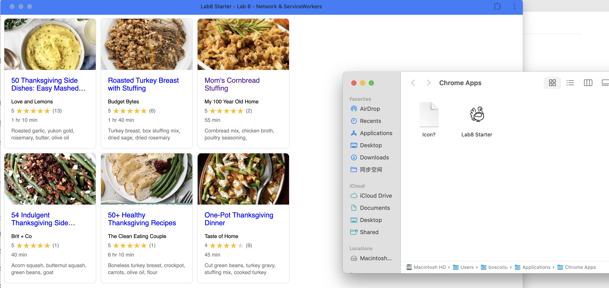

# Lab 8 - Network & ServiceWorkers

## Team Members
- Yanhua Liu

## Deployed GitHub Pages Link
https://boscoliu0.github.io/Lab8_Starter/

## How are graceful degradation and service workers related?

Graceful degradation means building apps that continue to function even when some features aren't supported. Service workers support graceful degradation by allowing apps to function offline or in poor network conditions by caching key resources, ensuring core functionality remains accessible even without internet.

## PWA

